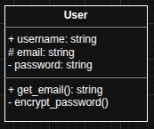
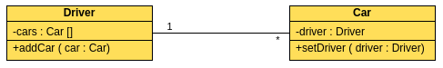
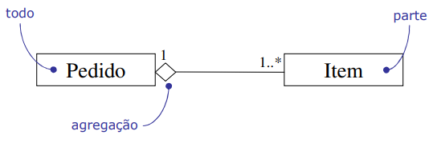
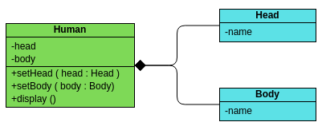
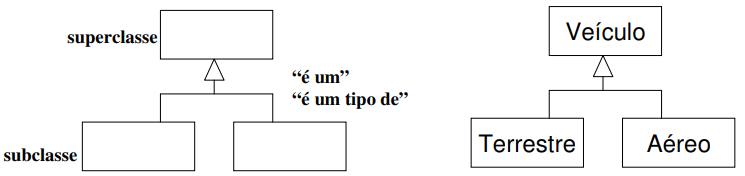
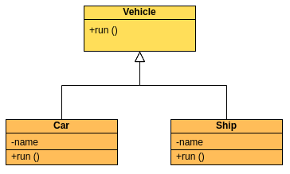
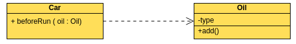

UML é uma linguagem para visualizar, especificar, construir e documentar os artefatos de um sistema de software. É uma forma de **desenhar e comunicar a estrutura e o comportamento de um software** antes ou durante o desenvolvimento, usando diagramas padronizados


# Materiais utilizados
- [UML Diagrams Full Course (Unified Modeling Language)](https://youtu.be/WnMQ8HlmeXc?si=s4HSQun6BfBNSpYW)
- [Quais São Os Seis Tipos De Relacionamentos Em Diagramas De Classes UML?](https://blog.visual-paradigm.com/pt/what-are-the-six-types-of-relationships-in-uml-class-diagrams/#Seis_tipos_de_relacionamentos)
- [Relacionamentos do Diagrama de Classes](https://homepages.dcc.ufmg.br/~figueiredo/disciplinas/aulas/uml-diagrama-classes-relacionamentos_v01.pdf)
- [UML: Diagrama de Classes](https://moodle.unesp.br/pluginfile.php/25933/mod_resource/content/1/diagrama_classes.pdf)


# Diagrama de classes
Representa **classes, atributos, métodos e os relacionamentos entre elas**

Representamos uma classe da seguinte maneira:



A ordem para representar uma classe é:
- Nome
- Atributos
- Métodos
	- Se não passarmos o tipo depois do `:` no método, significa que o retorno é `void`

```python
class User:

    def __init__(self, username, email):
        self.username = username
        self._email = email
        self.__password = None
    
    def get_email(self):
	    return self._email
	
	def __encrypt_password(self):
		pass
```

## Símbolos de visibilidade

### Proteção de atributos e métodos
- +: Atributo ou método publico
- #: Atributo ou método protegido
- -: Atributo ou método privado

### Classes abstratas
- Nome da classe fica em itálico
- Nome do método fica em itálico e negrito

## Relacionamentos

### Associação
Indica que uma propriedade de uma classe, contém uma referência a uma instância(s) de outra classe

O que significa que há uma conexão entre objetos diferentes. Determina instância(s) de uma classe, está de alguma forma ligada à instância(s) de outra classe

Existem quatro tipos de associações:
- Bidirecionais
	- Podem ter **duas setas** ou **nenhuma seta**
- Unidirecionais
	- Têm uma seta
- Auto-associação
	- Têm uma seta
- Vários números

Em um relacionamento de **multiplicidade**, podemos adicionar um número diretamente à linha associada, para indicar o número de objetos na classe correspondente:
- `1..1`: Apenas um
- `0..*`: Zero ou mais
- `1..*`:um ou mais
- `0..1`: Nenhum ou apenas um
- `m..n`: no mínimo m, no máximo n (m<=n)



Um carro corresponde a um determinado motorista e um motorista pode dirigir vários carros

### Agregação
Tipo especial de associação, todo-parte. Onde as informações de um objeto (todo) precisam ser complementadas por um objeto de outra classe (parte)

As duas classes podem existir independentemente, "tem um" fraco



Um objeto `parte` pode fazer parte de vários objetos `todo`

### Composição
Uma variação do relacionamento de **Agregação**, onde as duas classes não podem existir independentemente, "tem um" forte

Os objetos `parte` só podem pertencer a um único objeto `todo` e têm o seu tempo de vida coincidente com o dele



### Herança / Generalização


### Implementação / Realização
Uma classe implementa uma **interface ou classe abstrata**. Representada por uma **seta tracejada com triângulo vazio**



**Obs:** O exemplo não está com linhas tracejadas, mas deveria

### Dependência
Quando uma mudança na classe **A** cause uma mudança na classe **B**, então a classe **B** é dependente da classe **A**. Uma relação de dependência é uma relação de “uso”, uma mudança em uma determinada coisa pode afetar outras coisas que a utilizam

Representa que a alteração de um objeto (objeto independente) pode afetar outro objeto (objeto dependente)

Na maioria dos casos, as dependências são refletidas em **métodos de uma classe que usam o objeto de outra classe como parâmetro**


