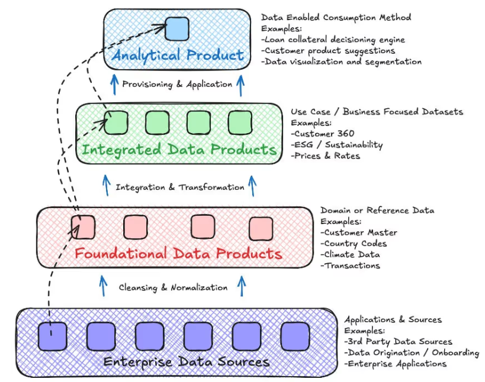

Esta nota tem como objetivo centralizar as informações sobre **Produtos de Dados**.

# Materiais utilizados
- [The Complete Guide to Data Products](https://www.moderndata101.com/blogs/what-are-data-products-the-complete-guide)
- [So I Have A Data Product... Now What?](https://www.moderndata101.com/blogs/so-i-have-a-data-product-now-what)

# Tópicos para aprofundar

## Dúvidas
Não temos um PO em dados, quem irá gerencias os produtos?

# Descrição
Um produto de dados é algo delimitado, governado, reutilizável e construído para resolver um objetivo de negocio em especifico. O objetivo final é ter um sistema modular, onde os produtos vão funcionar como peças de legas, que vamos montando o sistema reaproveitando e conectando as peças.

Os produtos devem ser desenvolvidos a fim de possuírem as seguintes características:
- Resolver problema especifico do negócio;
- Acessibilidade e fácil identificação;
- Ser utilizado sem inteferencia direta do time responsável;
- Confiável e possuir SLAs explícitos.

## Tipos de produtos

### Foundational Data Products
Possuem o objetivo de expor os dados do domínio de maneira reutilizável e governada sem grandes transformações. Seria as ingestões das fontes de dados até a camada **silver**.

### Integrated Data Products
Possuem o objetivo de integrar diversos produtos e aplicar as **regras de negócio**, a fim de gerar insights. Nesta etapa podemos combinar produtos de diversos domínios. Parece ser a camada onde criamos as fatos e dimensões

### Analytical Data Products
Possuem o objetivo de resolver um use case especifico, são uma camada de consumo, é o produto mais refinado.  Aqui poderiam se enquadrar:
- Big tables;
- Dashboards;
- Modelos de ML;
- ...

## Componentes de um produto

### Contratos de dados
Definição das expectativas de como os dados irão chegar. Estas expectativas incluem schema, tipos de dados, validações dos dados

### Transformações
Regras de negocio são documentadas e testadas a fim de gerarem o efeito desejado pelo negocio

### Metadata
Documentação, data lineage, ownership, guia de uso, ...

### Indicadores de qualidade
A data product defines measurable quality thresholds, such as freshness, completeness, accuracy, and reliability. Monitoring systems track these indicators continuously. Where appropriate, service-level guarantees formalise expectations for availability and performance.
