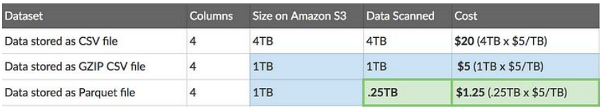

# Parquet
É um formato de armazenamento colunar open-source, criado pelo Twitter e Cloudera em 2013, amplamente adotado no ecossistema Hadoop/Spark e em soluções de Data Lake modernas. Suas principais características são:
- 

Um concorrente é o **Apache ORC** 

Casos de uso?
Quando não é ideal usar?

# Delta Lake

## Características
- Open source
- Transação ACID
- Merge
- Schema
- Auditoria e versionamento

Principal resolução para Lakehouse

## Otimização

### OPTIMIZE
Melhora a performance de leitura, pois compacta **pequenos arquivos** em **arquivos maiores**, reduzindo a quantidade de arquivos. Isso reduz o custo de leitura, já que menos arquivos precisam ser abertos durante um scan

Ajuda a prevenir o problema de **small files**

### VACUUM
É responsável por **remover fisicamente os arquivos que não são mais referenciados** no log de transações da tabela (arquivos "órfãos", antigos ou obsoletos).

Esses arquivos surgem quando você faz operações como:
- `UPDATE`
- `DELETE`
- `MERGE`
- `OVERWRITE`

O Spark não apaga imediatamente os arquivos antigos, para permitir funcionalidades como **Time Travel** e **consistência de leitura entre leitores e escritores**.

Podemos utilizar o parâmetro `RETAIN` para especificar quais arquivos queremos manter. Exemplo: `VACUUM minha_tabela RETAIN 24 HOURS`
