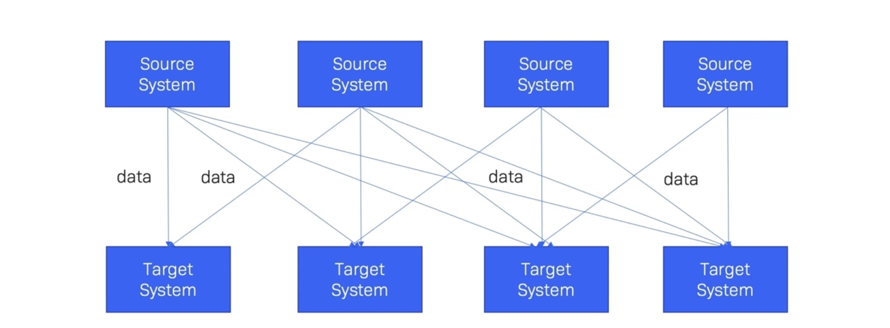
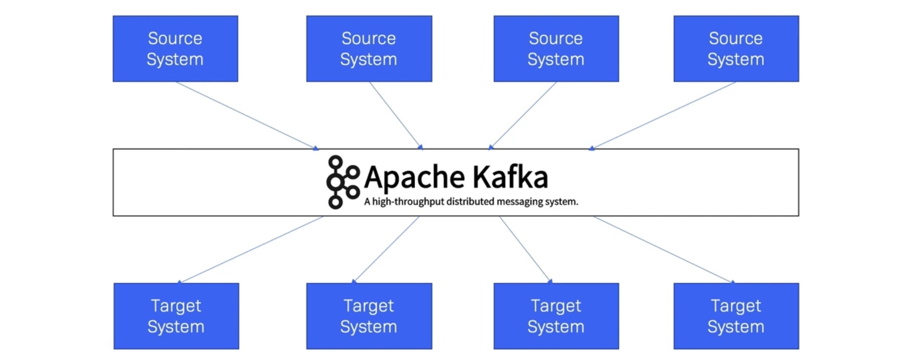
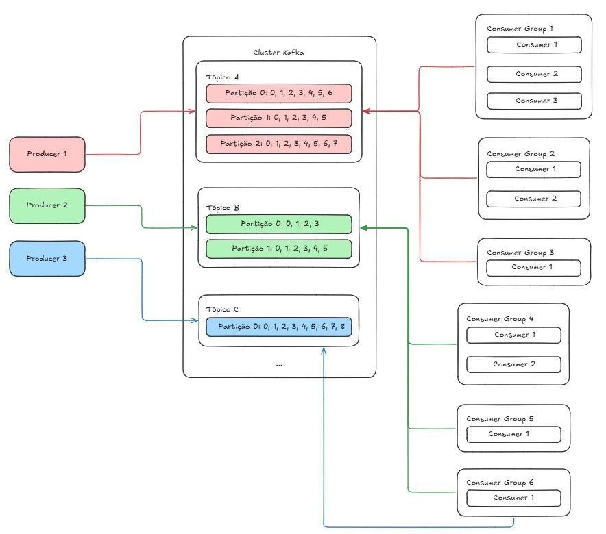
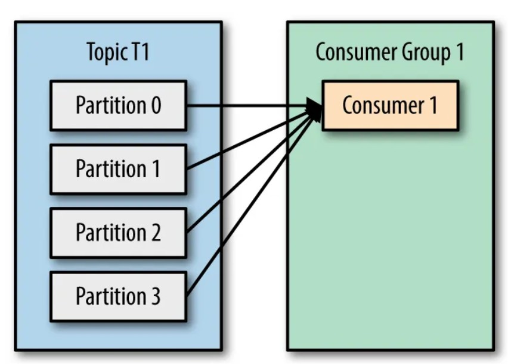
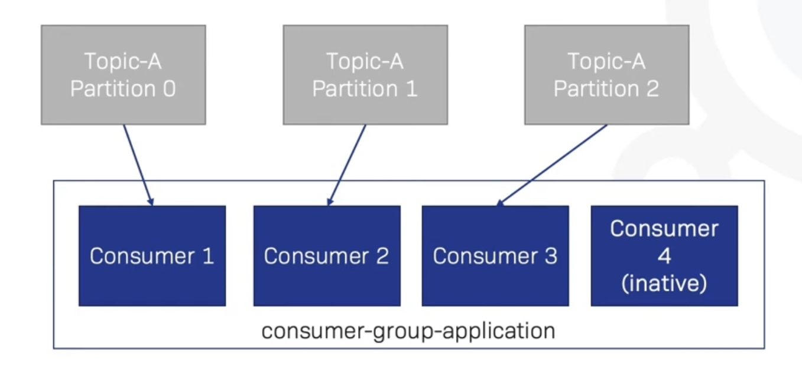
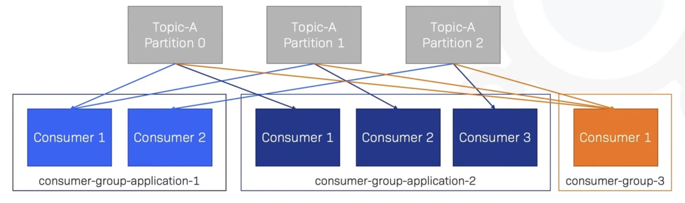

# Materiais utilizados
- [Apache Kafka: A Basic Introduction]([https://medium.com/@ahmedgulabkhan/a-basic-introduction-to-kafka-a7d10a7776e6](https://medium.com/@ahmedgulabkhan/a-basic-introduction-to-kafka-a7d10a7776e6))
- [Kafka Introduction]([https://kafka.apache.org/43/getting-started/introduction/](https://kafka.apache.org/43/getting-started/introduction/))
- [Kafka Partitions and Consumer Groups in 6 mins]([https://medium.com/javarevisited/kafka-partitions-and-consumer-groups-in-6-mins-9e0e336c6c00](https://medium.com/javarevisited/kafka-partitions-and-consumer-groups-in-6-mins-9e0e336c6c00))
- [Demystifying Kafka Lag: A Step-by-Step Guide to Monitoring and Resolving Lag Issues]([https://medium.com/@tetianaokhotnik/demystifying-kafka-lag-a-step-by-step-guide-to-monitoring-and-resolving-lag-issues-62e62bdc04dd](https://medium.com/@tetianaokhotnik/demystifying-kafka-lag-a-step-by-step-guide-to-monitoring-and-resolving-lag-issues-62e62bdc04dd))
- [Learn Apache Kafka with Conduktor - Free 3 hours course]([https://www.youtube.com/playlist?list=PLYmXYyXCMsfMMhiKPw4k1FF7KWxOEajsA](https://www.youtube.com/playlist?list=PLYmXYyXCMsfMMhiKPw4k1FF7KWxOEajsA))
- [Kafka Topic Naming Conventions](https://cnr.sh/posts/2017-08-29-how-paint-bike-shed-kafka-topic-naming-conventions/)
- [Kafka: The Definitive Guide]([https://www.confluent.io/resources/ebook/kafka-the-definitive-guide/](https://www.confluent.io/resources/ebook/kafka-the-definitive-guide/))
- [Confluent Developer](https://developer.confluent.io/)

# Introdução
**Apache Kafka** é um sistema distribuído que possibilita a comunicação entre sistemas de maneira assíncrona, projetado para receber, armazenar e distribuir grandes volumes de dados em tempo real, de forma confiável e escalável.

**Analogia**: Imagine um sistema de correios dentro de uma empresa, onde vários departamentos precisam trocar informações o tempo todo:
- Em vez de cada departamento ligar diretamente para o outro, o que vira um caos conforme a empresa cresce, todos enviam e recebem mensagens por uma **central**;
- Quem envia a mensagem não precisa saber quem vai ler;
- Quem lê a mensagem escolhe o próprio ritmo de leitura;
- As mensagens ficam guardadas na central por um período, então se alguém estava ocupado, ainda pode ler depois.

**Kafka é essa central**, só que no lugar de cartas, trafegam eventos.

**Exemplo de arquitetura sem Kafka**

**Exemplo de arquitetura sem Kafka**

# Principais conceitos
| Conceito           | Descrição                                                                                                                                                                                                                                                                |
| ------------------ | ------------------------------------------------------------------------------------------------------------------------------------------------------------------------------------------------------------------------------------------------------------------------ |
| **Broker**         | É um servidor do Kafka, a máquina que recebe, armazena e entrega os eventos.                                                                                                                                                                                             |
| **Cluster**        | É um conjunto de brokers trabalhando juntos.                                                                                                                                                                                                                             |
| **Evento**         | É um registro de algo que aconteceu num momento específico. Exemplos: usuário fez login, pagamento aprovado. É sempre algo no **passado**, imutável.                                                                                                                     |
| **Tópico**         | É o canal nomeado onde os eventos são publicados e lidos, é como uma pasta em um sistema de arquivos. Funciona como uma **categoria ou assunto**: `pagamentos`, `cliques`, `logs-de-erro`.                                                                               |
| **Partição**       | É a subdivisão interna de um tópico. Cada tópico é dividido em N partições, e os eventos são distribuídos entre elas. É o que permite o Kafka escalar. **Um core do Spark consegue ler apenas uma partição por vez do Kafka.**                                           |
| **Offset**         | É o número de posição de um evento dentro de uma partição, começa em 0 e só cresce. É utilizado pelo Consumer para identificar os eventos que já foram lidos.                                                                                                            |
| **Producer**       | É qualquer aplicação que **publica eventos** num tópico do Kafka.                                                                                                                                                                                                        |
| **Consumer**       | É qualquer aplicação que **lê eventos** de um tópico do Kafka.                                                                                                                                                                                                           |
| **Consumer Group** | É um grupo de Consumers que **cooperam para ler um tópico juntos**. Os Consumers de um grupo irão receber eventos de partições distintas.                                                                                                                                |
| **Lag**            | É o **atraso do Consumer**, a diferença entre o último offset disponível no tópico e o offset que o Consumer já processou. Um lag de 0 significa que está em dia. Um lag alto significa que o Consumer está ficando para trás e pode indicar um problema de performance. |
| **Retention**      | Refere-se ao tempo que os eventos são mantidos no tópico antes de serem apagados automaticamente pelo Kafka.                                                                                                                                                             |

**Observação:** Consumers do mesmo consumer group **não leem os mesmos eventos**, eles dividem as partições do tópico entre si. Por exemplo, se temos dois consumers associados ao mesmo consumer group, que estão coletando eventos de um tópico que possui 4 partições, cada consumers receberá dados de 2 partições distintas, ou seja, cada consumer receberá um conjunto diferente de eventos. As imagens abaixo estão mostrando a relação entre tópico, partição, consumer e consumer group.

## Estrutura dos eventos
![[kafka_message_anatomy.png]]
